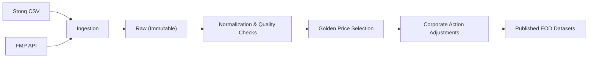

> This post is adapted from the project README and focuses on architectural decisions and operational tradeoffs.

# Financial Market Data Pipeline

## Why I built this

I’ve worked on enough production systems to know that “just ingest the data” is usually where correctness goes to die.

Market data looks simple on the surface — prices go up, prices go down — but real-world feeds are late, corrected, inconsistent across vendors, and full of edge cases. Corporate actions like splits and dividends add another layer of complexity that can quietly corrupt historical data if they’re handled casually.

This project is my way of demonstrating how I think about systems like this. I’d rather build something **deterministic, auditable, and operationally sane** than something flashy that breaks the moment reality shows up.

---

## The problem in one paragraph

The goal is to ingest end-of-day (EOD) OHLCV price data and corporate actions from multiple third-party vendors, normalize and validate that data, select a canonical “golden” price per symbol per day, apply deterministic corporate action adjustments, and publish final datasets for downstream consumers.

The system must support reruns, backfills, and vendor corrections without silent overwrites or loss of lineage. Correctness and reproducibility matter more than latency.

---

## Constraints first, architecture second

Before touching architecture, I locked in a few non-negotiable constraints:

- **Correctness over latency** — EOD batch processing is acceptable
- **Immutable raw data** — no in-place mutation of vendor data
- **Idempotent ingestion** — duplicate deliveries must be safe
- **Deterministic recomputation** — history must be rebuildable on demand
- **Full lineage** — every derived record must be traceable to its source

These constraints shape the system far more than any specific technology choice.

---

## High-level architecture

The pipeline is intentionally layered. Each stage produces **new derived data** rather than mutating existing records, which keeps recomputation explicit and auditable.

---

## Core design principles

### 1. Immutable raw data

Vendor data is stored exactly as received, in an append-only raw layer. This provides:

- a permanent audit trail  
- safe replay and historical backfills  
- insulation from upstream vendor corrections  

Raw data is never updated or deleted. Every downstream artifact is derived from it.

---

### 2. Batch identity as a first-class concept

Every vendor delivery is treated as a batch, uniquely identified by:

`(vendor, dataset, as_of_date, source_checksum)`

This single decision unlocks several important guarantees:

- duplicate deliveries with the same checksum are ignored safely  
- corrections create new batches instead of overwriting history  
- recomputation becomes explicit and traceable  

Batch identity is one of those unglamorous details that quietly holds the entire system together.

---

### 3. Derived data only (no silent overwrites)

Normalized prices, golden prices, and adjusted prices are all **derived tables**.

If something changes upstream, affected date ranges are recomputed from raw data. Historical results are never silently patched in place. This avoids the most dangerous failure mode in data systems: quietly changing the past.

---

## Example schema: raw_prices

To keep the design concrete, here’s a representative raw table:

| Column           | Type        | Description                         |
|------------------|-------------|-------------------------------------|
| batch_id         | UUID        | Ingestion batch identifier           |
| vendor           | TEXT        | Data vendor                          |
| symbol           | TEXT        | Vendor symbol                        |
| as_of_date       | DATE        | Trading date                         |
| payload          | JSON / TEXT | Raw vendor payload                   |
| source_checksum  | TEXT        | File-level checksum                  |
| ingested_at      | TIMESTAMP   | Ingestion timestamp                  |

Everything else in the pipeline can be rebuilt from this foundation.

---

## Normalization and quality checks

Vendor-specific schemas are normalized into a canonical model, and basic quality rules are applied:

- missing or null fields  
- invalid prices  
- obvious outliers  

Invalid records are **quarantined**, not discarded. The pipeline continues processing valid data even when partial failures occur, making data quality issues visible instead of destructive.

---

## Golden price selection

Once data is normalized, the pipeline selects a single canonical EOD price per symbol per day.

Golden price selection is:

- **explicit** — driven by rules, not assumptions  
- **deterministic** — identical inputs produce identical outputs  
- **traceable** — provenance metadata is stored alongside results  

Golden prices represent the trusted truth for downstream consumers.

---

## Corporate actions: where pipelines usually break

Corporate actions are where many market data pipelines quietly fail.

In this system:

- split events are normalized into a clean representation  
- historical prices are **back-adjusted deterministically**  
- adjusted outputs are versioned and fully recomputable from raw data  

Back-adjustment ensures downstream consumers see a continuous price series without hiding the fact that adjustments occurred.

---

## Modular monolith vs microservices

This pipeline is intentionally implemented as a **modular monolith**.

That choice optimizes for:

- correctness  
- development velocity  
- operational simplicity  

Microservices become justified only when:

- independent scaling is required  
- release coupling becomes limiting  
- team size and operational maturity justify the added complexity  

Distributed systems are not a default — they’re a tradeoff.

---

## What I intentionally didn’t build

This project deliberately excludes:

- real-time streaming ingestion  
- dashboards or UIs  
- authentication and authorization  
- production-grade infrastructure  

Not because they’re difficult, but because they’re **orthogonal** to the core design problem: correctness, lineage, and deterministic recomputation.

---

## What’s next

Possible extensions include:

- dividend adjustments  
- versioned historical snapshots  
- backtesting-ready datasets  
- exports to columnar formats for downstream analytics  

Each extension builds on the same foundational principles rather than changing them.

---

## Closing thoughts

This project mirrors how real-world financial data systems are designed and operated when correctness and trust matter more than speed.

The most important parts aren’t the libraries or the code — they’re the decisions around immutability, batch identity, and recomputation under imperfect data.

---

**Source code:** [https://github.com/tkalp/fin-eod-pipeline](https://github.com/tkalp/fin-eod-pipeline)
